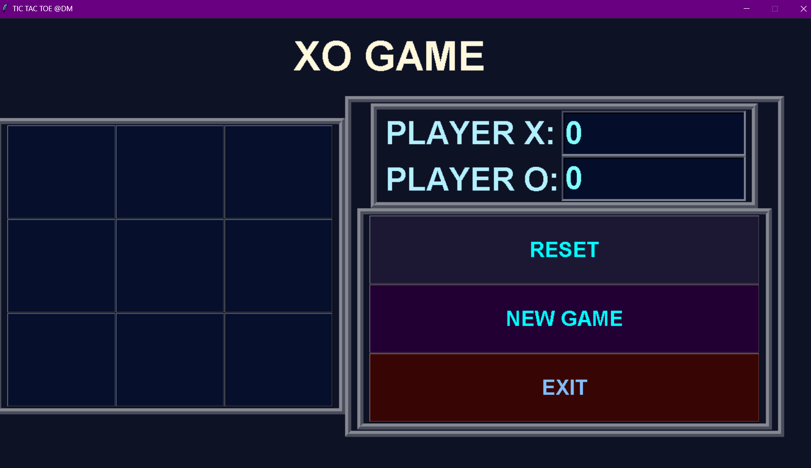
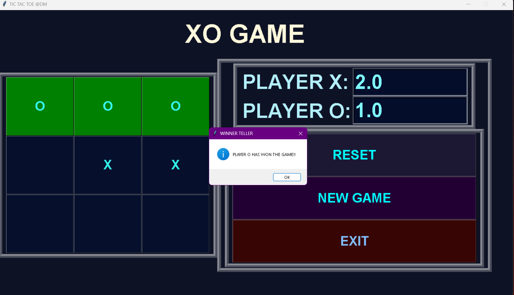
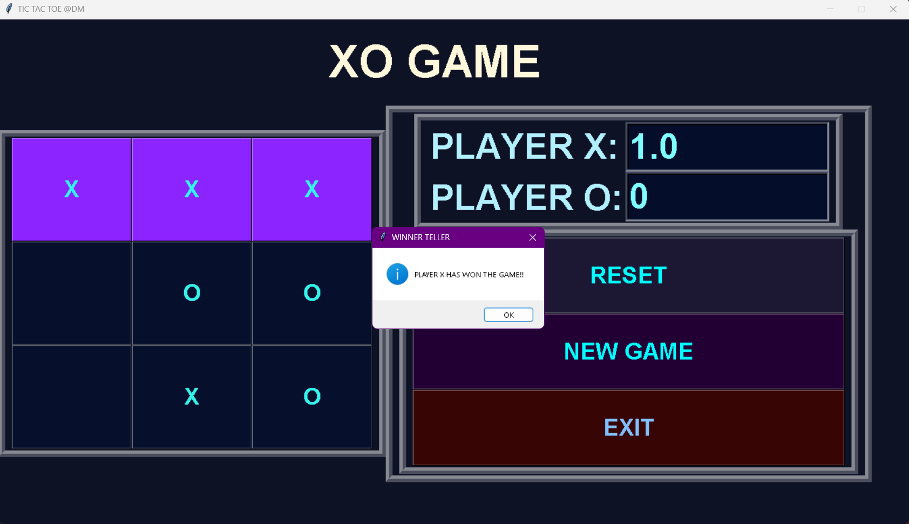

Project-5
# 🎮 Tic Tac Toe @DM

A visually appealing Tic Tac Toe game built with Python's Tkinter library 🐍.  
This project features a modern UI with custom colors, player score tracking, and interactive gameplay.

---

## ✨ Features

- ❌⭕ **Classic Tic Tac Toe** game for two players (X and O).
- 📊 Player scores are **tracked and displayed**.
- 🌈 **Color-coded winning lines** to highlight the winner.
- 🔄 **Reset** and 🆕 **New Game** buttons to restart or clear scores.
- 🚪 Exit button with confirmation prompt.
- 🎨 Responsive and **visually attractive UI** using custom RGB colors.
- 🖥️ Designed with Tkinter frames and widgets for a clean layout.

---

## 📸 Screenshots

Here’s what the game looks like:

  
  


---

## ▶️ How to Run

1. Make sure you have **Python** installed (Python 3 recommended).
2. Clone the repository or download the files.
3. Run the script:

   ```bash
   python tic_tac_toe.py
